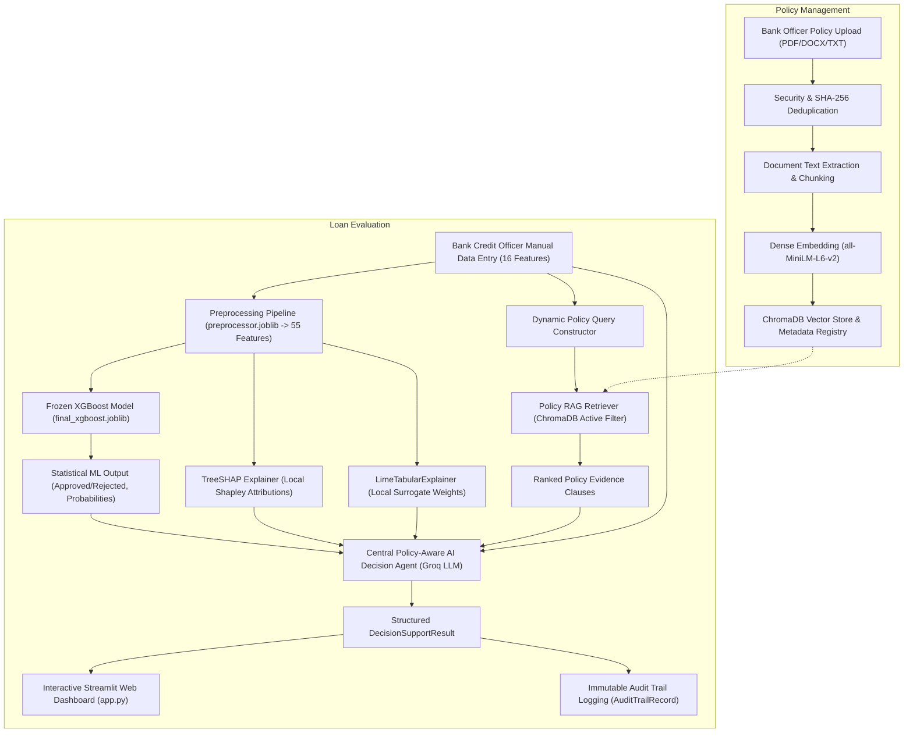

# An Explainable Policy-Aware Agentic AI Decision Support System for Bank Loan Evaluation Using Machine Learning Predictions

## 1. Research Overview & Objectives
This research project proposes a comprehensive, trustworthy, and policy-aware AI decision support system for banking and financial institutions evaluating loan applications. 

By unifying **Machine Learning Predictions** (XGBoost classification model), **Explainable AI (XAI)** (SHAP and LIME), **Retrieval-Augmented Generation (RAG)** (ChromaDB vector store for banking regulatory policies), and **Multi-Agent Orchestration** (Agentic AI powered by Groq LLM), the system provides transparent, compliant, and well-reasoned loan approval recommendations through an interactive **Streamlit Decision Support & Policy Management Interface**.

---

## 2. Current Implementation Phase
- **Current Phase:** **Step 16: Bank Officer Policy Management & RAG Ingestion Implemented & Validated**
- **Status:** Complete end-to-end research prototype is fully operational (`app.py`). Bank Credit Officers can:
  1. **Manage Policies:** Upload, validate, index, and govern institutional credit policy documents (PDF, DOCX, TXT) with SHA-256 deduplication and lifecycle management (`active`, `superseded`, `archived`).
  2. **Verify Retrieval:** Interactively test vector search against indexed policy clauses.
  3. **Evaluate Loan Applicants:** Manually input applicant details (16 empirical attributes), execute automated feature validation and preprocessing, obtain preserved XGBoost statistical scores, inspect TreeSHAP & LIME local feature attributions, retrieve active ChromaDB policy evidence, and receive structured decision-support recommendations from the Central Groq AI Decision Agent with full immutable audit trail logging.

---

## 3. End-to-End Research Pipeline



---

## 4. How to Run the Application Locally

```bash
# 1. Install dependencies
pip install -r requirements.txt

# 2. (Optional) Configure Groq API Key in .env
# If omitted, the system seamlessly operates using its deterministic offline fallback engine.
# cp .env.example .env

# 3. Launch the Streamlit Web Application
streamlit run app.py
```

The web application will launch at: `http://localhost:8501`. Use the sidebar to toggle between:
- `🏦 Loan Evaluation`: Applicant data entry, ML scoring, XAI attributions, policy grounding, and AI decision support.
- `📚 Policy Management`: Institutional policy document upload, lifecycle status management, and retrieval verification.

---

## 5. Dataset Architecture & Provenance

### Primary Authoritative Research Dataset
1. **Primary Dataset (Dataset v2):** `data/synthetic/loan_evaluation_dataset_3000_v2.csv`
   - **Type:** 500 empirical Google Form survey responses + 2,500 Gaussian Copula synthetic records.
   - **Size:** 3,000 records, 17 columns (16 predictors + 1 target).
   - **Target Distribution:** `Approved`: 1,396 (46.53%), `Rejected`: 1,604 (53.47%).
   - **Status:** **CURRENT AUTHORITATIVE RESEARCH DATASET** — Restores empirical feature-target correlations (+104% Cramér's V gain over CTGAN).

### Primary Empirical Seed Dataset
2. **Empirical Seed Dataset:** `data/raw/google_form_responses_500.csv`
   - **Type:** Empirical questionnaire responses collected via Google Form surveys.
   - **Size:** 500 records, 17 columns.
   - **Target Distribution:** `Approved`: 232 (46.40%), `Rejected`: 268 (53.60%).
   - **Status:** Unchanged baseline seed for statistical modeling.

### Archived Historical Datasets
3. **Archived CTGAN Dataset (Legacy Benchmark):** `archive/datasets/loan_evaluation_dataset_3000.csv`
   - **Status:** **ARCHIVED / HISTORICAL** (Preserved for scientific comparison).
4. **Archived Synthetic 2000 Dataset:** `archive/datasets/loan_evaluation_synthetic_2000_up_to_100m.csv`
   - **Status:** **ARCHIVED / HISTORICAL** (Initial proof-of-concept dataset).
5. **Archived Candidate Datasets:** `archive/datasets/candidates/` (`ctgan_2500.csv`, `gaussian_copula_2500.csv`, `tvae_2500.csv`).

---

## 6. Machine Learning Benchmark Summary ($N=600$ Test Set)

| Evaluation Metric | Random Forest (Baseline) | CatBoost (Benchmark) | XGBoost (Proposed Model) | Best Performing Model |
|---|---|---|---|---|
| **Holdout Accuracy** | `0.5867` (58.67%) | `0.6033` (60.33%) | **`0.6200` (62.00%)** | **XGBoost** |
| **Precision (Approved)** | `0.5572` (55.72%) | `0.5686` (56.86%) | **`0.5825` (58.25%)** | **XGBoost** |
| **Recall (Approved)** | `0.5412` (54.12%) | `0.6093` (60.93%) | **`0.6452` (64.52%)** | **XGBoost** |
| **F1-Score (Approved)** | `0.5491` (54.91%) | `0.5882` (58.82%) | **`0.6122` (61.22%)** | **XGBoost** |
| **ROC-AUC Score** | `0.6290` (62.90%) | `0.6236` (62.36%) | **`0.6468` (64.68%)** | **XGBoost** |
| **Average Precision (AP)** | `0.5572` (55.72%) | `0.5570` (55.70%) | **`0.5818` (58.18%)** | **XGBoost** |
| **Model Binary Artifact** | `models/baseline/final_random_forest.joblib` | `models/catboost/final_catboost.joblib` | `models/xgboost/final_xgboost.joblib` | **XGBoost Selected** |

---

## 7. Active Repository Directory Structure

```
loan-agentic-ai/
│
├── app.py                                          # Main Streamlit web application entry point
│
├── data/
│   ├── raw/
│   │   └── google_form_responses_500.csv           # 500 empirical survey seed records
│   ├── synthetic/
│   │   └── loan_evaluation_dataset_3000_v2.csv     # PRIMARY AUTHORITATIVE DATASET (3,000 records)
│   ├── processed/
│   │   ├── X_train.csv                             # Preprocessed training features (2,400 x 55)
│   │   ├── X_test.csv                              # Preprocessed holdout test features (600 x 55)
│   │   ├── y_train.csv                             # Encoded training target labels (2,400 x 1)
│   │   ├── y_test.csv                              # Encoded holdout test target labels (600 x 1)
│   │   ├── preprocessor.joblib                     # Fitted ColumnTransformer pipeline
│   │   └── feature_names.json                      # 55 final transformed feature names
│   ├── dataset_schema.md                           # 17-attribute schema specification
│   ├── preprocess_dataset.py                       # Final dataset v2 preprocessing pipeline
│   ├── preprocessing_config.md                     # Preprocessing categorical tier documentation
│   ├── validate_seed_dataset.py                    # Empirical seed validator script
│   ├── sdv_compare_synthesizers.py                 # Multi-synthesizer benchmark & generator
│   └── validate_dataset_v2.py                      # Dataset v2 validation & model readiness
│
├── models/
│   ├── baseline/
│   │   ├── train_final_random_forest.py            # Final RF baseline training pipeline
│   │   └── final_random_forest.joblib              # FINAL RANDOM FOREST BASELINE MODEL
│   ├── catboost/
│   │   ├── train_final_catboost.py                 # CatBoost benchmark training pipeline
│   │   └── final_catboost.joblib                   # CATBOOST BENCHMARK MODEL ARTIFACT
│   └── xgboost/
│       ├── train_final_xgboost.py                  # Final XGBoost proposed model pipeline
│       └── final_xgboost.joblib                    # FINAL PROPOSED XGBOOST MODEL (SELECTED)
│
├── explainability/
│   ├── shap_explainer.py                           # TreeSHAP computation and visualization pipeline
│   └── lime_explainer.py                           # LimeTabularExplainer and consistency pipeline
│
├── rag/
│   ├── __init__.py                                 # Package exports
│   ├── config.py                                   # Centralized RAG configuration & parameters
│   ├── document_processor.py                       # PDF/DOCX/TXT extraction & chunking
│   ├── embedding_service.py                        # Local sentence-transformers embedding service
│   ├── vector_store.py                             # Persistent ChromaDB vector database manager
│   ├── ingest.py                                   # Document ingestion manager & registry
│   ├── retriever.py                                # Policy clause retriever & evidence formatter
│   ├── test_retrieval.py                           # RAG test and verification suite
│   ├── documents/                                  # Policy storage folder (populated by bank officers)
│   ├── processed/                                  # Chunk and extraction cache
│   ├── vectorstore/                                # ChromaDB persistent vector database
│   └── metadata/
│       └── documents_registry.json                 # Policy documents registry
│
├── agents/
│   ├── __init__.py                                 # Agent package exports
│   ├── schemas.py                                  # Strongly-typed Pydantic schemas & enums
│   ├── llm_service.py                              # Groq LLM client interface & JSON mode
│   ├── decision_agent.py                           # Central policy-aware reasoning agent
│   └── orchestrator.py                             # Master multimodal orchestrator
│
├── ui/
│   ├── __init__.py                                 # UI helper exports
│   ├── styles.py                                   # Custom CSS and themes
│   ├── forms.py                                    # Manual applicant data entry form & presets
│   ├── components.py                               # Modular UI cards, XAI tabs & audit logs
│   └── policy_ui.py                                # Bank Officer Policy Management interface
│
├── tests/
│   ├── test_decision_agent.py                      # Decision agent unit tests & injection defense
│   ├── test_orchestrator.py                        # Master orchestrator integration tests
│   ├── test_streamlit_app.py                       # Streamlit UI & preset validation tests
│   └── test_policy_management.py                   # Policy upload, deduplication & lifecycle tests
│
├── evaluation/
│   ├── final_model_comparison_v2.csv               # 3-Model comparative metrics table (RF vs. XGB vs. CatBoost)
│   ├── final_model_comparison.csv                  # RF vs. XGBoost comparative metrics table
│   ├── final_dataset_v2_summary.json               # Preprocessing metadata summary JSON
│   ├── final_random_forest_results.json            # Final RF baseline evaluation JSON
│   ├── final_random_forest_confusion_matrix.csv    # Final RF confusion matrix CSV
│   ├── final_random_forest_predictions.csv         # Final RF test predictions CSV
│   ├── final_random_forest_cross_validation.csv    # Final RF 5-fold CV metrics CSV
│   ├── final_random_forest_feature_importance.csv  # Final RF Gini feature importances CSV
│   ├── final_random_forest_classification_report.json # Final RF classification report JSON
│   ├── final_random_forest_roc_curve.png           # Final RF ROC curve
│   ├── final_random_forest_precision_recall_curve.png # Final RF PR curve
│   ├── final_catboost_results.json                 # CatBoost benchmark evaluation JSON
│   ├── final_catboost_confusion_matrix.csv         # CatBoost confusion matrix CSV
│   ├── final_catboost_predictions.csv              # CatBoost test predictions CSV
│   ├── final_catboost_cross_validation.csv         # CatBoost 5-fold CV metrics CSV
│   ├── final_catboost_feature_importance.csv       # CatBoost feature importances CSV
│   ├── final_catboost_classification_report.json   # CatBoost classification report JSON
│   ├── final_catboost_roc_curve.png                # CatBoost ROC curve
│   ├── final_catboost_precision_recall_curve.png   # CatBoost PR curve
│   ├── final_xgboost_results.json                  # Final XGBoost evaluation JSON
│   ├── final_xgboost_confusion_matrix.csv          # Final XGBoost confusion matrix CSV
│   ├── final_xgboost_predictions.csv               # Final XGBoost test predictions CSV
│   ├── final_xgboost_cross_validation.csv          # Final XGBoost 5-fold CV metrics CSV
│   ├── final_xgboost_feature_importance.csv        # Final XGBoost Gain feature importances CSV
│   ├── final_xgboost_classification_report.json    # Final XGBoost classification report JSON
│   ├── final_xgboost_roc_curve.png                 # Final XGBoost ROC curve
│   ├── final_xgboost_precision_recall_curve.png    # Final XGBoost PR curve
│   ├── shap_global_importance.csv                  # Global Mean Absolute SHAP feature importances
│   ├── shap_summary.png                            # Global SHAP beeswarm summary plot
│   ├── shap_feature_importance.png                 # Global SHAP bar plot
│   ├── shap_local_examples.csv                     # Local SHAP attributions for 4 representative cases
│   ├── shap_local_example.png                      # Local SHAP multi-panel plot
│   ├── lime_local_examples.csv                     # Local LIME attributions for 4 representative cases
│   ├── lime_local_example.png                      # Local LIME multi-panel plot
│   ├── shap_lime_consistency.csv                   # SHAP vs. LIME cross-method consistency table
│   ├── synthesizer_distribution_comparison.csv     # Synthesizer distribution comparison table
│   └── synthesizer_selection.csv                   # Multi-synthesizer benchmark matrix
│
├── docs/
│   ├── project_audit.md                            # Comprehensive project inventory & audit table
│   ├── project_cleanup_report.md                   # Cleanup and architecture freeze report
│   ├── policy_management.md                        # Policy management architecture & user guide
│   ├── streamlit_decision_support_interface.md     # Streamlit prototype architecture & user guide
│   ├── central_policy_aware_agent.md               # Central AI Decision Agent architecture & evaluation
│   ├── policy_rag_architecture.md                  # Comprehensive Policy RAG architecture report
│   ├── feature_mapping.md                          # 16-feature to 55-model feature mapping guide
│   ├── xai_explainability.md                       # Comprehensive SHAP & LIME XAI report
│   ├── catboost_benchmark.md                       # CatBoost benchmark & 3-model comparative report
│   ├── synthetic_data_improvement.md               # Synthesizer benchmark & dataset v2 report
│   ├── final_preprocessing_v2.md                   # Final preprocessing v2 report
│   ├── final_random_forest_baseline.md             # Final Random Forest baseline report (v2)
│   ├── final_xgboost_model.md                      # Final XGBoost proposed model report (v2)
│   ├── final_model_comparison.md                   # Final RF vs. XGBoost comparative report (v2)
│   └── model_diagnostic_analysis.md                # Diagnostic analysis report
│
├── archive/
│   ├── datasets/                                   # Historical datasets (CTGAN 3000, Synthetic 2000, candidates)
│   ├── models/                                     # Historical model binaries & training scripts
│   ├── evaluation/                                 # Historical evaluation outputs & diagnostic scripts
│   └── docs/                                       # Historical evaluation markdown documentation
│
├── requirements.txt
├── .env.example
├── .gitignore
└── README.md
```

---

## 8. Technology Stack
- **Language & Core:** Python, pandas, NumPy, SciPy, Matplotlib
- **Synthetic Data Augmentation:** SDV (Synthetic Data Vault), GaussianCopula, CTGAN, TVAE, PyTorch
- **Machine Learning:** scikit-learn, XGBoost, CatBoost
- **Explainability:** SHAP (TreeSHAP), LIME (LimeTabularExplainer)
- **Retrieval & Knowledge Grounding:** ChromaDB, Sentence-Transformers, PyPDF, python-docx
- **LLM Reasoning & Agents:** Groq Cloud LLM (`llama-3.3-70b-versatile`), Pydantic, python-dotenv
- **User Interface:** Streamlit (v1.60+)
