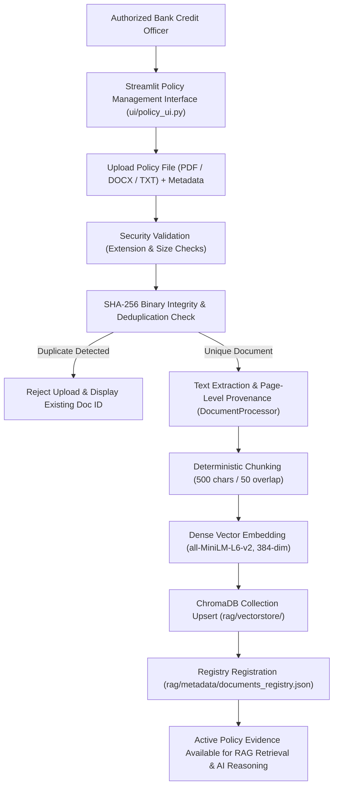

# Bank Officer Policy Management & RAG Document Ingestion: Architecture & Operational Guide

## 1. Executive Summary & Research Context
- **Research Title:** *“An Explainable Policy-Aware Agentic AI Decision Support System for Bank Loan Evaluation Using Machine Learning Predictions”*
- **Implementation Phase:** **Step 16 — Bank Officer Policy Management & RAG Document Ingestion**
- **Core Purpose:** Empowers authorized Bank Credit Officers to upload, validate, index, and manage institutional credit policies and underwriting guidelines through the Streamlit web interface without developer intervention.
- **Core Principle:** The system remains **strictly policy-neutral** until verified institutional documents are uploaded. Zero fake, simulated, or hardcoded policy rules exist in the repository.

> [!IMPORTANT]
> **Governance & Security Boundaries:**
> 1. **External Document-Driven Grounding:** All policy evidence originates strictly from documents uploaded by authorized bank officers.
> 2. **SHA-256 Deduplication:** Duplicate document uploads are detected via cryptographic hashing and rejected to prevent vector database bloating.
> 3. **Lifecycle Governance:** Policy documents can transition across `active`, `superseded`, and `archived` states. Only `active` policies are retrieved during live loan applicant evaluations.
> 4. **Advisory Decision Support:** Retrieved policy evidence provides context for human underwriters and the Central AI Decision Agent; it does not execute automated or autonomous loan approvals.

---

## 2. Bank Officer Policy Management Workflow



---

## 3. Supported Document Formats & Ingestion Pipeline

| Format | Parser Engine | Provenance Extraction Strategy |
|---|---|---|
| **PDF (`.pdf`)** | `pypdf.PdfReader` | Exact physical page numbers (`page_number: 1, 2, ...`). |
| **DOCX (`.docx`)** | `docx.Document` | Paragraph and section structural blocks (`page_number: -1`). |
| **TXT (`.txt`)** | UTF-8 Stream Reader | Clean text segmentation (`page_number: -1`). |

### 3.1 Security & Ingestion Constraints
- **Max File Size:** `15 MB` per document.
- **Extension Whitelist:** `.pdf`, `.docx`, `.txt`. Executable, binary, and script files are strictly rejected.
- **Inert Text Extraction:** Strips null bytes, non-printable characters, and ignores embedded macros or script objects.
- **Prompt Injection Isolation:** Retrieved policy text is enclosed in `<retrieved_policy_evidence>` tags and treated as untrusted external reference data by the Central AI Decision Agent.

---

## 4. Policy Metadata & Provenance Design

Every document indexed through the Policy Management interface maintains an immutable record in `rag/metadata/documents_registry.json`:

```json
{
  "document_id": "doc_7b10fdf853af",
  "document_name": "Commercial Credit Secured Lending Policy",
  "document_type": "PDF",
  "source_file": "Commercial_Credit_Policy_2026.pdf",
  "file_hash": "7b10fdf853af7328904a14c99553b499148d...",
  "file_size_bytes": 245820,
  "total_extracted_blocks": 12,
  "total_chunks": 34,
  "chunks_indexed": 34,
  "upload_timestamp": "2026-08-23T12:00:00.000000+00:00",
  "policy_version": "2026.Q1",
  "effective_date": "2026-01-01",
  "status": "active",
  "description": "Retail and commercial secured credit facility underwriting rules."
}
```

Each chunk stored in the ChromaDB collection `bank_policies` retains:
- `document_id`, `document_name`, `chunk_id` (e.g. `doc_7b10fdf853af_chunk_0001`), `chunk_index`, `page_number`, `policy_version`, `effective_date`, `status`.

---

## 5. Policy Lifecycle Governance (Active, Superseded, Archived)

Credit policies evolve as regulatory guidelines and macroeconomic conditions change. The Policy Management interface allows bank officers to adjust document status on the fly:

1. **`active` (Default):** The document represents current operational lending policy. The `PolicyRetriever` includes these chunks in live applicant evaluation queries.
2. **`superseded`:** The policy has been replaced by a newer version or circular. Chunks remain stored in ChromaDB and registered in metadata for historical auditability, but are **excluded** from live evaluation retrieval queries (`filter_active_only=True`).
3. **`archived`:** Historical policy preserved strictly for compliance audits. Excluded from live operational retrieval.

---

## 6. Interactive Retrieval Verification Panel

To allow credit underwriters to test and verify knowledge retrieval before processing live loans, the Policy Management page includes a **Test Policy Retrieval** panel:
- **Natural Language Search:** Underwriters can query topics (e.g. *"What are the mandatory collateral requirements for commercial loans?"*).
- **Provenance Inspector:** Displays ranked results with exact Document Name, Version, Page Number, Chunk ID, Similarity Score, and Excerpt Text.
- **Active Filtering Toggle:** Allows officers to compare active policy retrieval vs. historical archived clauses.

---

## 7. Zero-Policy Knowledge Base Behavior

If no policy documents have been uploaded to `rag/documents/`:
- **Policy Management View:** Displays:
  > *“⚠️ Policy Knowledge Base Empty: No institutional policy documents have been supplied. Policy-grounded verification cannot be completed.”*
- **Loan Evaluation View:** Displays:
  > *“⚠️ Policy Verification: Not Available. No real bank policy documents have been supplied. Policy-grounded verification cannot be completed.”*
- **Central AI Decision Agent Output:** Assigns `policy_status: NO_POLICY_AVAILABLE` and recommends **`MANUAL_REVIEW`**.
- **Scientific Guarantee:** The system will never fabricate, simulate, or hallucinate bank lending rules.

---

## 8. Verification & Test Results (`tests/test_policy_management.py`)

- [x] **Unsupported File Rejection:** Verified that `.exe` and unauthorized file types are blocked.
- [x] **Empty File Rejection:** Verified that 0-byte documents are rejected.
- [x] **Sandbox Lifecycle & Deduplication:** Tested temporary document ingestion, duplicate hash detection, active cosine similarity retrieval, transition to `superseded`, and clean sandbox deletion.
- [x] **Active Filtering:** Verified that `filter_active_only=True` excludes superseded documents from search results.
- [x] **Production Repository Cleanliness:** Confirmed `rag/documents/` contains 0 fake documents.
