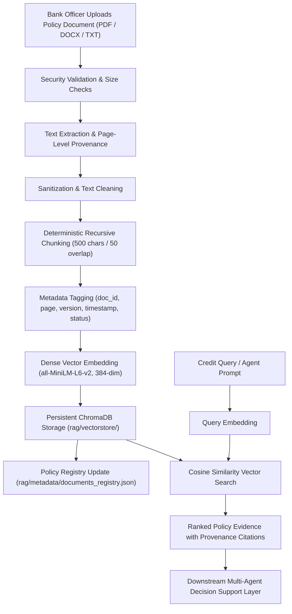

# Policy Retrieval-Augmented Generation (RAG) Architecture Report

## 1. Executive Summary & Research Context
- **Research Title:** *“An Explainable Policy-Aware Agentic AI Decision Support System for Bank Loan Evaluation Using Machine Learning Predictions”*
- **Implementation Phase:** **Step 13 — Policy RAG Knowledge Base Foundation**
- **Objective:** Establish an extensible, document-driven Retrieval-Augmented Generation (RAG) subsystem capable of indexing bank underwriting guidelines, regulatory circulars, and credit policies provided by authorized bank officers.
- **Core Principle:** Policy rules are **externally supplied by human banking experts** rather than hard-coded into application logic. The RAG knowledge base operates in a policy-neutral state until real bank documents are uploaded.

> [!IMPORTANT]
> **Academic Integrity & Decision Support Boundary:**
> 1. **Policy Evidence vs. Decision Authority:** RAG retrieval provides policy evidence to the reasoning layer; retrieved text does not directly constitute a final loan decision.
> 2. **Neutrality & Zero Fabrication:** No fake or simulated bank policy rules are hardcoded or pre-indexed into the system.
> 3. **Separation from Machine Learning Output:** The RAG layer does not alter the frozen XGBoost classifier probability output ($\hat{P}=0.6200$, $\text{ROC-AUC}=0.6468$). It acts as an independent evidence layer for downstream Agentic AI reasoning.

---

## 2. Why Policies are Externally Supplied (Document-Driven Design)

Traditional rule-based credit scoring engines hardcode underwriting thresholds (e.g. `IF loan_amount > 5,000,000 AND collateral == 'No' THEN REJECT`). However, this hardcoded approach suffers from critical limitations:
1. **Dynamic Regulatory Evolution:** Lending policies, interest caps, and reserve ratios change frequently across economic cycles and regulatory jurisdictions (e.g. Central Bank circulars).
2. **Institutional Customization:** Different banking institutions maintain distinct risk appetites, product portfolios, and collateral haircuts.
3. **Auditable Provenance:** By ingesting source PDF/DOCX policy documents, every reasoning step can cite exact document names, sections, and page numbers, creating an immutable audit trail.

---

## 3. End-to-End Document Ingestion & Retrieval Pipeline



---

## 4. Technical Component Specifications

### 4.1 Document Processor (`rag/document_processor.py`)
- **Supported File Formats:** PDF (`.pdf` via `pypdf`), Word (`.docx` via `python-docx`), Plain Text (`.txt` via UTF-8).
- **Text Extraction:**
  - **PDF:** Page-by-page text extraction retaining exact 1-indexed `page_number`.
  - **DOCX & TXT:** Paragraph and section block extraction (`page_number: -1`).
- **Security Sanitization:** Strips null bytes, non-printable control characters, and ignores embedded macros or executable objects.
- **Deterministic Chunking:**
  - **`chunk_size`:** `500` characters (~100 tokens).
  - **`chunk_overlap`:** `50` characters (~10 tokens).
  - **Splitting Strategy:** Recursive natural boundary splitting prioritizes paragraph breaks (`\n\n`), newlines (`\n`), sentences (`. `), and phrases (`, `).
  - **Unique Identifier:** Structured identifier format `<doc_id>_chunk_<index:04d>`.

### 4.2 Embedding Service (`rag/embedding_service.py`)
- **Architecture:** Abstract base class `BaseEmbeddingService` enabling modular provider swapping.
- **Default Local Provider:** `LocalSentenceTransformerEmbeddingService` using `all-MiniLM-L6-v2`.
- **Vector Dimension:** `384` floating-point numbers.
- **Normalization:** Vectors are $L_2$-normalized for efficient cosine similarity search.
- **Zero API Dependency:** Operates fully offline without external API keys or recurring compute costs.

### 4.3 Persistent Vector Database (`rag/vector_store.py`)
- **Technology:** `ChromaDB` (`chromadb.PersistentClient`).
- **Persistence Path:** `rag/vectorstore/`.
- **Collection Name:** `bank_policies`.
- **Distance Metric:** Cosine similarity ($hnsw:space = "cosine"$).
- **Stored Data per Vector:** Embedding vector, raw text chunk, and sanitized metadata dictionary.

### 4.4 Ingestion Manager & Registry (`rag/ingest.py`)
- **Registry Location:** `rag/metadata/documents_registry.json`.
- **Audit Metadata Tracked per Document:**
  - `document_id`: Unique hash-derived identifier (e.g. `doc_7b10fdf853af`).
  - `document_name`: Human-readable title.
  - `document_type`: File format (`PDF`, `DOCX`, `TXT`).
  - `source_file`: Original filename.
  - `file_hash`: SHA-256 binary hash for integrity verification and deduplication.
  - `file_size_bytes`: Document size in bytes.
  - `total_chunks`: Total parsed chunks.
  - `upload_timestamp`: ISO 8601 UTC timestamp.
  - `policy_version`: Semantic version string (e.g. `"1.0"`, `"2026.Q1"`).
  - `effective_date`: Operational policy start date.
  - `status`: Lifecycle state (`active`, `superseded`, `archived`).

### 4.5 Policy Retriever (`rag/retriever.py`)
- **Search Mechanism:** Computes dense vector representation of input query and executes nearest-neighbor search against active collection chunks.
- **Default Top-K:** `3` clauses (configurable).
- **Result Structure:**
  - `document_name`, `document_id`, `chunk_id`, `page_number`, `relevance_score`, `distance`, `text`, `metadata`.
- **Evidence Formatter:** Formats retrieved clauses into standardized citation blocks for credit officers and downstream agent prompts.

---

## 5. Security & Trust Boundaries

| Risk Category | Security Measure Implemented |
|---|---|
| **Untrusted File Uploads** | File extension whitelist (`.pdf`, `.docx`, `.txt`), maximum file size cap (15 MB), and strict text extraction without executing macros or embedded objects. |
| **Code Injection in Policy Text** | Policy text is treated purely as inert textual data strings; it is never evaluated or passed to `eval()` or code execution engines. |
| **Data Integrity & Provenance** | SHA-256 file hashing detects unauthorized document tampering or duplicate uploads. |
| **Lifecycle Governance** | Deprecated or superseded policy guidelines can be marked `status: superseded` or `status: archived`, excluding them from live operational retrieval queries. |

---

## 6. Current Knowledge Base State & Audit Statement

```
===========================================================================
[POLICY RAG AUDIT STATEMENT]
No policy documents were indexed because no real bank policy documents were supplied.
===========================================================================
```

- **Documents in `rag/documents/`:** `0`
- **Indexed Policies in Registry:** `0`
- **Total Chunks in Chroma Vector Store:** `0`
- **Verification:** Pipeline test suite executed via `rag/test_retrieval.py` validated extraction, chunking, embedding, vector storage, retrieval, and clean sandbox teardown with 100% test success.

---

## 7. Comparative System Architecture (Future Milestone Preview)

The establishment of this Policy RAG Foundation enables the upcoming empirical comparison between two distinct paradigms:

```
SYSTEM A — ML PREDICTION ONLY
Applicant Data → XGBoost Model (P=0.6200) → SHAP/LIME Feature Attributions

SYSTEM B — POLICY-AWARE AGENTIC AI SYSTEM (PROPOSED)
Applicant Data → XGBoost Model (P=0.6200) + SHAP/LIME Explanations
                        +
Bank Policy Upload → Policy RAG Retrieval (Top-K Evidence Clauses)
                        ↓
Policy-Aware Multi-Agent Reasoning (Credit Officer Agent + Policy Compliance Agent)
                        ↓
Transparent, Regulatory-Grounded Loan Recommendation
```
