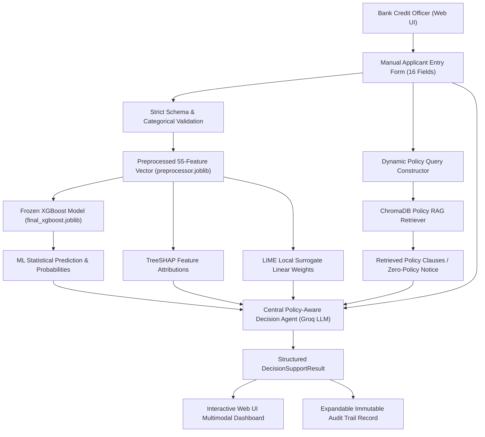

# Streamlit Decision Support Interface: Prototype Architecture & User Guide

## 1. Executive Summary & Research Context
- **Research Title:** *“An Explainable Policy-Aware Agentic AI Decision Support System for Bank Loan Evaluation Using Machine Learning Predictions”*
- **Implementation Phase:** **Step 15 — Streamlit Decision Support Interface**
- **Objective:** Provide an interactive, professional web application (`app.py`) allowing bank credit underwriters to manually input applicant details and execute the complete multimodal evaluation pipeline:
  $$\text{Manual Entry} \rightarrow \text{Validation} \rightarrow \text{Preprocessing} \rightarrow \text{Frozen XGBoost} \rightarrow \text{SHAP/LIME} \rightarrow \text{Policy RAG} \rightarrow \text{Central Groq Agent} \rightarrow \text{Decision Support}$$

> [!IMPORTANT]
> **Advisory Nature & Zero Autonomous Commitment:**
> 1. **Decision Support Tool Only:** The web interface is strictly an advisory decision-support prototype. It does **NOT** autonomously approve or reject real loans.
> 2. **Manual Entry Scope:** In this research prototype, applicant information is manually entered by the credit officer. Automated document parsing, OCR, and PDF extraction are future research enhancements and are intentionally omitted from Step 15.
> 3. **Statistical Core Preservation:** Raw XGBoost predictions and probabilities ($\hat{P}=0.6200$, $\text{ROC-AUC}=0.6468$) are displayed directly and preserved without tampering.
> 4. **Policy Neutrality:** Zero fake bank policy documents or hardcoded banking rules are added.

---

## 2. End-to-End Application Architecture



---

## 3. Applicant Data Entry Form (16 Empirical Predictor Attributes)

The manual entry form (`ui/forms.py`) provides dropdown/selectbox controls strictly matching the categorical hierarchies in `preprocessor.joblib` and `loan_evaluation_dataset_3000_v2.csv`:

| # | Attribute Name | Input Control Type | Valid Categorical Options |
|---|---|---|---|
| 1 | **Age Group** | Selectbox | `Below 25`, `25–34`, `35–44`, `45–54`, `55–64`, `65 or above` |
| 2 | **Gender** | Selectbox | `Female`, `Male`, `Prefer not to say` |
| 3 | **Marital Status** | Selectbox | `Divorced`, `Married`, `Prefer not to say`, `Single`, `Widowed` |
| 4 | **Number of Dependents** | Selectbox | `0`, `1`, `2`, `3`, `4`, `5 or more` |
| 5 | **Education Level** | Selectbox | `Diploma`, `No formal education`, `Other`, `Postgraduate degree`, `Primary`, `Secondary`, `Undergraduate degree` |
| 6 | **Employment Type** | Selectbox | `Business owner`, `Contract employee`, `Government employee`, `Other`, `Private-sector employee`, `Retired`, `Self-employed`, `Unemployed` |
| 7 | **Employment Duration** | Selectbox | `Not employed/business`, `Less than 1 year`, `1–2 years`, `3–5 years`, `6–10 years`, `More than 10 years` |
| 8 | **Monthly Income** | Selectbox | `Below Rs.50,000`, `Rs.50,000–99,999`, `Rs.100,000–149,999`, `Rs.150,000–249,999`, `Rs.250,000–399,999`, `Rs.400,000–599,999`, `Rs.600,000–999,999`, `Rs.1,000,000 or above` |
| 9 | **Existing Loan Status** | Selectbox | `No`, `Yes` |
| 10 | **Monthly Loan Repayment**| Selectbox | `No existing loan`, `Below Rs.10,000`, `Rs.10,000–24,999`, `Rs.25,000–49,999`, `Rs.50,000–74,999`, `Rs.75,000–99,999`, `Rs.100,000+` |
| 11 | **Loan Type** | Selectbox | `Agricultural`, `Business`, `Education`, `Housing`, `Other`, `Personal`, `Vehicle` |
| 12 | **Requested Loan Amount** | Selectbox | `Below Rs.500,000`, `Rs.500,000–999,999`, `Rs.1,000,000–4,999,999`, `Rs.5,000,000–9,999,999`, `Rs.10,000,000–24,999,999`, `Rs.25,000,000–49,999,999`, `Rs.50,000,000–74,999,999`, `Rs.75,000,000–99,999,999`, `Rs.100,000,000 or above` |
| 13 | **Loan Purpose** | Selectbox | `Agriculture`, `Business investment`, `Debt consolidation`, `Education`, `House purchase/construction`, `Medical expenses`, `Other`, `Personal expenses`, `Vehicle purchase` |
| 14 | **Collateral Availability**| Selectbox | `No`, `Not applicable / Not required`, `Yes` |
| 15 | **Guarantor Availability** | Selectbox | `No`, `Yes` |
| 16 | **Required Documents Submitted** | Selectbox | `No, some missing`, `Not sure`, `Yes, all` |

---

## 4. UI Dashboard Sections & Layout

### Section 1: ML Prediction (Statistical Model Output)
- **Visuals:** Metric cards for Predicted Class (`Approved (1)` / `Rejected (0)`), $P(\text{Approved})$ percentage bar, and $P(\text{Rejected})$ percentage bar.
- **Labeling:** Explicitly labeled *"ML Prediction — Statistical Model Output (Advisory)"*.

### Section 2: Explainable AI (XAI) Attribution Tabs
- **Tab A — TreeSHAP:** Positive drivers pushing toward approval vs. negative drivers pushing toward rejection.
- **Tab B — LIME Local Surrogate:** Local linear surrogate weights supporting vs. opposing approval.

### Section 3: Policy Verification (RAG Layer)
- **Zero-Policy Knowledge Base Scenario (Current State):**
  > *“⚠️ Policy Verification: Not Available. No real bank policy documents have been supplied. Policy-grounded verification cannot be completed.”*
- **Active Documents Scenario:** Dynamically renders expandable cards showing document name, page number, chunk ID, relevance score, and excerpt text.

### Section 4: Central AI Decision Support Recommendation
- **Visual Badges:**
  - `✅ APPROVE_SUPPORT` (Green)
  - `❌ REJECT_SUPPORT` (Red)
  - `⚠️ MANUAL_REVIEW` (Amber)
  - `ℹ️ INSUFFICIENT_INFORMATION` (Gray)
- **Reasoning Narrative:** Full multi-paragraph synthesis from Groq LLM.
- **Policy Findings & Discrepancies:** Clear bullet points identifying regulatory alignment or risk flags.

### Section 5: Immutable Underwriting Audit Trail
- Expandable panel rendering complete sanitized execution telemetry (`request_id`, model version, probabilities, SHAP/LIME factors, RAG query, chunk counts, confidence score). Zero API keys or secrets are logged.

---

## 5. Preset Profiles for Evaluator Testing

To facilitate instant testing, the interface includes four built-in test profile presets matching the representative cases from Step 12:
1. **Case 1 (True Positive):** High Monthly Income, Complete Docs, Collateral Available $\rightarrow$ ML predicts `Approved` ($P=0.8724$), Agent recommends `MANUAL_REVIEW` (due to zero policy documents).
2. **Case 2 (True Negative):** Extreme Loan Amount (Rs. 75M+), Incomplete Docs, Contract Job $\rightarrow$ ML predicts `Rejected` ($P=0.0474$), Agent flags extreme leverage.
3. **Case 3 (False Positive Scenario):** Education Loan, Clean History, Unsecured $\rightarrow$ Demonstrates how downstream policy agents can intercept statistical approvals lacking collateral.
4. **Case 4 (False Negative Scenario):** Low Income, Existing Loan, Missing Docs $\rightarrow$ Demonstrates how policy agents can recommend document curing.

---

## 6. How to Run the Application Locally

```bash
# 1. Ensure dependencies are installed
pip install -r requirements.txt

# 2. (Optional) Configure Groq API Key in .env
# Copy template and add your key:
# cp .env.example .env

# 3. Launch Streamlit Application
streamlit run app.py
```

The application will open automatically in your browser at:
`http://localhost:8501`
