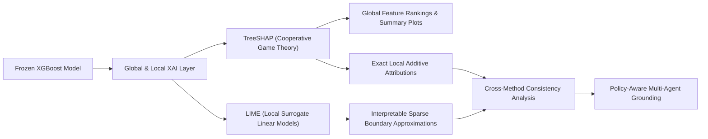

# Explainable AI (XAI) Evaluation Report: TreeSHAP and LIME Framework

## 1. Executive Summary & Research Context
- **Research Title:** *“An Explainable Policy-Aware Agentic AI Decision Support System for Bank Loan Evaluation Using Machine Learning Predictions”*
- **Implementation Phase:** **Step 12 — Machine Learning Explainability (SHAP & LIME Framework)**
- **Objective:** Establish comprehensive global and local explainability for the selected **XGBoost proposed model** (`models/xgboost/final_xgboost.joblib`) on the preprocessed 3,000-record dataset v2 (`loan_evaluation_dataset_3000_v2.csv`).
- **Core Principle:** The XGBoost classifier acts as a frozen predictive scoring engine. This phase does not retrain the model or alter decision thresholds, but rather provides mathematically grounded explanations for *why* the model generated a specific credit score or recommendation.

> [!IMPORTANT]
> **Academic Integrity & Decision Support Scope:**
> 1. **Statistical Output vs. Banking Authority:** The XGBoost prediction is a statistical model output and is not itself a final banking decision.
> 2. **Decision Support Role:** The machine learning model and its associated explainability values function solely as decision-support signals for human credit officers and downstream policy-aware agents.
> 3. **Non-Causal Interpretability:** Feature importance and Shapley values describe empirical model attribution within this dataset. They do not establish real-world causal mechanisms or dictate official institutional lending policies.

---

## 2. Why Explainable AI (XAI) is Required in Bank Loan Evaluation
1. **Regulatory Compliance and Fair Lending:** Banking regulations (e.g. Equal Credit Opportunity Act, GDPR Article 22, Basel III/IV governance) mandate that automated credit assessment systems must provide transparent, auditable reasons for adverse credit decisions.
2. **Auditability and Trust:** Credit underwriters cannot accept "black-box" predictions without understanding the specific financial drivers that influenced the model's posterior probability.
3. **Bridge to Policy-Aware Agentic Reasoning:** Local feature attributions serve as the empirical input to downstream LLM-powered Multi-Agent modules, enabling agents to cross-examine statistical predictions against codified regulatory banking policies.

---

## 3. Explainability Methodologies: SHAP vs. LIME

### 3.1 TreeSHAP (SHapley Additive exPlanations)
- **Mathematical Foundation:** Grounded in cooperative game theory (Shapley values), TreeSHAP calculates the marginal contribution of each feature across all possible feature coalitions:
  $$\phi_i(x) = \sum_{S \subseteq F \setminus \{i\}} \frac{|S|!(|F| - |S| - 1)!}{|F|!} \left[ f_x(S \cup \{i\}) - f_x(S) \right]$$
- **Theoretical Guarantees:** TreeSHAP uniquely satisfies four fundamental axiomatic properties: **Efficiency**, **Symmetry**, **Dummy (Null Player)**, and **Additivity**.
- **Polynomial-Time Complexity:** For tree-based models like XGBoost, TreeSHAP executes in $O(TLD^2)$ time rather than exponential $O(2^{|F|})$ time.

### 3.2 LIME (Local Interpretable Model-agnostic Explanations)
- **Mathematical Foundation:** LIME approximates complex non-linear decision boundaries locally around an instance $x$ by fitting an interpretable surrogate linear model $g \in G$:
  $$\xi(x) = \arg\min_{g \in G} \mathcal{L}(f, g, \pi_x) + \Omega(g)$$
  where $\pi_x(z)$ defines an exponential proximity kernel around the perturbed neighborhood of $x$.
- **Role in Research:** LIME provides an independent, model-agnostic verification mechanism to confirm whether local linear approximations corroborate TreeSHAP attributions.

---

## 4. Global SHAP Explainability Analysis ($N=600$ Test Instances)

### 4.1 Global Feature Importance (Mean Absolute SHAP Value)

| Rank | Feature Name | Mean \|SHAP Value\| | Normalized Share (%) | Primary Directional Impact |
|---|---|---|---|---|
| 1 | `Required Documents Submitted_Yes, all` | `0.2197` | **9.77%** | Strong positive impact on approval when present ($=1$). |
| 2 | `Existing Loan Status_No` | `0.2030` | **9.03%** | Absence of existing debt strongly pushes toward approval. |
| 3 | `Requested Loan Amount` | `0.1845` | **8.21%** | Higher loan amounts exert strong negative pressure on approval. |
| 4 | `Collateral Availability_No` | `0.1389` | **6.18%** | Lack of collateral increases credit risk and pushes toward rejection. |
| 5 | `Monthly Income` | `0.1187` | **5.28%** | Higher monthly income tiers increase approval log-odds. |
| 6 | `Age Group` | `0.0977` | **4.34%** | Middle/higher age groups correlate with credit stability. |
| 7 | `Monthly Loan Repayment` | `0.0857` | **3.81%** | Existing monthly repayment obligations reduce disposable cash flow. |
| 8 | `Loan Type_Education` | `0.0777` | **3.45%** | Positive impact on approval probability. |
| 9 | `Gender_Male` | `0.0762` | **3.39%** | Moderate demographic variation. |
| 10 | `Employment Duration` | `0.0753` | **3.35%** | Longer employment tenure increases approval probability. |

- Persisted to: [evaluation/shap_global_importance.csv](file:///d:/loan-agentic-ai/evaluation/shap_global_importance.csv)

### 4.2 Global SHAP Diagnostic Visualizations

#### SHAP Summary Beeswarm Plot

*Figure 1: SHAP Beeswarm Plot illustrating the distribution of Shapley values for the top 15 features across all 600 holdout test instances. Red dots represent high feature values; blue dots represent low feature values.*

#### Global SHAP Feature Importance Bar Plot

*Figure 2: Mean Absolute Shapley Values ranking the global impact of features on XGBoost loan predictions.*

---

## 5. Local Explainability on 4 Deterministic Representative Cases

To evaluate local explanations rigorously across the entire confusion matrix, four deterministic test cases were selected representing **True Positives**, **True Negatives**, **False Positives**, and **False Negatives**:

| Case Identifier | Test Index | Actual Label | XGBoost Predicted Class | Predicted Probability $\hat{P}(\text{App})$ | Decision Category |
|---|---|---|---|---|---|
| **Case 1 (TP)** | `39` | Approved (1) | **Approved (1)** | `0.8724` | **True Positive** |
| **Case 2 (TN)** | `460` | Rejected (0) | **Rejected (0)** | `0.0474` | **True Negative** |
| **Case 3 (FP)** | `503` | Rejected (0) | **Approved (1)** | `0.8463` | **False Positive** |
| **Case 4 (FN)** | `461` | Approved (1) | **Rejected (0)** | `0.1048` | **False Negative** |

---

### 5.1 Local Case Analysis

#### Case 1: True Positive (Test Index 39) — Highly Confident Correct Approval
- **Applicant Profile:** High Monthly Income (Rs. 250,000–399,999), Complete Documents (`Yes, all`), No Existing Loans, Collateral Available (`Yes`), Vehicle Loan.
- **SHAP Attribution:** Positive push from high `Monthly Income` ($+0.230$), `Requested Loan Amount` ($+0.241$), and complete documentation ($+0.124$).
- **LIME Attribution:** Identifies documentation complete ($+0.092$) and moderate loan amount ($+0.079$) as primary drivers supporting approval.
- **Banking Decision Alignment:** Fully aligns with prudential credit standards.

#### Case 2: True Negative (Test Index 460) — Highly Confident Correct Rejection
- **Applicant Profile:** Low/Moderate Income (Rs. 100,000–149,999), Extreme Loan Request (Rs. 75,000,000–99,999,999), Incomplete Documents (`No, some missing`), No Collateral, No Guarantor, 4 Dependents, Contract Employment.
- **SHAP Attribution:** Massive negative penalties from extreme `Requested Loan Amount` ($-0.958$), missing documentation ($-0.937$), and contract employment.
- **LIME Attribution:** Large negative weights on `Requested Loan Amount > 4.00` ($-0.143$) and missing documentation ($-0.106$).
- **Banking Decision Alignment:** Accurately flags severe over-leverage and missing mandatory documentation.

#### Case 3: False Positive (Test Index 503) — Statistical Approval of Actual Rejection
- **Applicant Profile:** Monthly Income Rs. 150,000–249,999, Zero Dependents, Complete Documents (`Yes, all`), No Existing Loans, Guarantor Available (`Yes`), Education Loan (Rs. 5,000,000–9,999,999), Collateral (`No`).
- **SHAP Attribution:** Strong positive push from `Loan Type_Education` ($+0.701$), moderate loan quantum ($+0.274$), and no existing debt ($+0.244$).
- **LIME Attribution:** Emphasizes complete documentation ($+0.096$) and education loan type ($+0.091$) pushing probability to $0.8463$.
- **Significance for Agentic Decision Support:** The statistical model recommended approval based on strong surface attributes. However, ground truth rejected this application (likely due to unsecured collateral policy). This illustrates why downstream **RAG policy checking** is essential to intercept statistical false approvals.

#### Case 4: False Negative (Test Index 461) — Statistical Rejection of Actual Approval
- **Applicant Profile:** Low Income (Rs. 50,000–99,999), Large Loan Request (Rs. 10,000,000–24,999,999), Incomplete Documents (`No, some missing`), Existing Loan (`Yes`), Housing Loan, Collateral (`Yes`).
- **SHAP Attribution:** Heavy negative penalties from missing documents ($-0.726$), existing debt obligations, and low income.
- **LIME Attribution:** Negative weights on missing documents ($-0.099$) and low income driving probability down to $0.1048$.
- **Significance for Agentic Decision Support:** The statistical model rejected the applicant due to low income and missing files, whereas human underwriters approved it (likely due to exceptional tangible collateral). Downstream policy agents can identify this discrepancy and request document cure rather than outright rejection.

---

### 5.2 Local Explanation Figures

#### Local SHAP Attributions (4 Representative Cases)

*Figure 3: Local SHAP waterfall/bar attributions across the 4 representative cases (TP, TN, FP, FN).*

#### Local LIME Attributions (4 Representative Cases)

*Figure 4: Local LIME surrogate linear feature weights across the same 4 representative test cases.*

---

## 6. SHAP vs. LIME Consistency Analysis

| Case ID | Actual Label | XGBoost Prediction | Probability | SHAP Primary Drivers | LIME Primary Drivers | Consistency & Agreement Finding |
|---|---|---|---|---|---|---|
| **Case 1 (TP)** | Approved (1) | **Approved (1)** | `0.8724` | `Requested Loan Amount` (+), `Monthly Income` (+), `Required Documents` (+) | `Required Documents` (+), `Requested Loan Amount` (+), `Gender` (+) | **High Consistency:** Both explainers identify strong income, reasonable quantum, and complete documentation as positive drivers. |
| **Case 2 (TN)** | Rejected (0) | **Rejected (0)** | `0.0474` | `Requested Loan Amount` (-), `Required Documents` (-), `Employment` (-) | `Requested Loan Amount` (-), `Required Documents` (-), `Loan Type` (-) | **Strong Consensus:** Both explainers assign overwhelming negative weights to extreme loan quantum and missing documentation. |
| **Case 3 (FP)** | Rejected (0) | **Approved (1)** | `0.8463` | `Loan Type_Education` (+), `Requested Loan Amount` (+), `Existing Loan_No` (+) | `Required Documents` (+), `Loan Type_Education` (+), `Requested Loan Amount` (+) | **High Alignment:** Both methods explain the false approval as driven by favorable education loan type and clean debt history. |
| **Case 4 (FN)** | Approved (1) | **Rejected (0)** | `0.1048` | `Required Documents` (-), `Loan Type_Housing` (-), `Monthly Income` (-) | `Required Documents` (-), `Loan Type_Education <= 0` (-), `Gender` (-) | **High Consistency:** Both explainers identify missing documentation and low cash-flow capacity as the decisive rejection factors. |

- Persisted to: [evaluation/shap_lime_consistency.csv](file:///d:/loan-agentic-ai/evaluation/shap_lime_consistency.csv)

---

## 7. Limitations & Crucial Scientific Distinctions

1. **Statistical Contribution vs. Real-World Causality:**
   - SHAP and LIME values quantify how changing a feature alters the *model's internal mathematical log-odds*.
   - A high SHAP value does **not** prove that increasing income causes creditworthiness in the real world, nor does it guarantee loan repayment.
2. **Correlation Artifacts in Synthetic Tabular Data:**
   - Feature attributions reflect patterns present in the 3,000-record Gaussian Copula augmented dataset. Unmeasured real-world factors (credit bureau scores, macroeconomic conditions) are not captured.
3. **XAI Does NOT Override Bank Policy:**
   - An applicant may receive a high statistical probability of approval ($\hat{P}=0.85$) and positive SHAP attributions, yet violate a non-negotiable institutional credit policy (e.g. maximum loan-to-value ratio, mandatory collateral requirements, or sanctioned party checks).
   - Therefore, ML predictions and XAI explanations must feed into a **Policy-Aware Retrieval-Augmented Generation (RAG)** and **Agentic AI reasoning layer** before any final recommendation is rendered.
